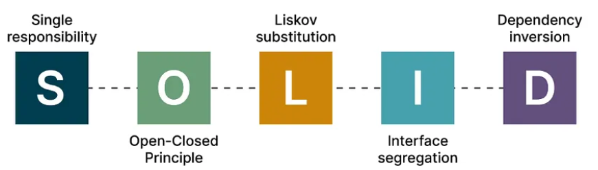

# SOLID Principles

SOLID stands for
- **S**ingle Responsibility Principle
- **O**pen-closed Principle
- **L**iskov Substitution Principle
- **I**nterface Segregation Principle
- **D**ependency Inversion Principle

